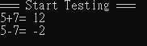

# Cross Platform Library Development
This project will demonstrate how to build the cross platform library from c++ source code.

## Environment
||Windows|Android|iOS|
|-|-|-|-|
|IDE|Visual Studio 17 2022|Android Studio 2022.3.1|Xcode 15.3|
||||

## Window (Shared library)
1. Use windows system to execute the `windows-build-lib.bat` file to make c++ library.
2. The output will copy to `./test/windows/lib` and  `./test/windows/include`.
3. Execute the `./test/windows-build.bat` to make a windows application `Test.exe`.
4. The execute result:  

## Android (JNI method, shared library)
1. Use windows system to execute the `android-build-lib.bat` file to make android .so library.
2. The output will copy to `./test/androd/app/src/main/jniLibs` and  `./test/androd/app/src/main/java/com`.
3. Use `Android Studio` to execute the `./test/android/build.gradle` to make a android application.
4. The execute result:  

## iOS (framework, static library)
1. Use Mac to execute the `ios-build-lib.sh` file to make android .framework library.
2. The output will copy to `./test/ios/test/test/lib`.
3. Use `Xcode` to execute the `./test/ios/test/test.xcodeproj` to make a ios application.
4. The execute result:  
